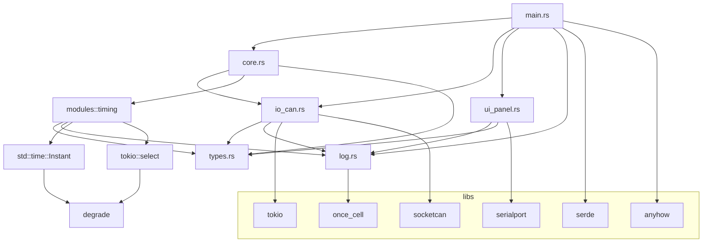
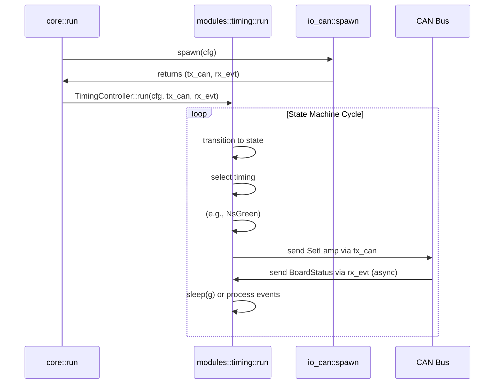
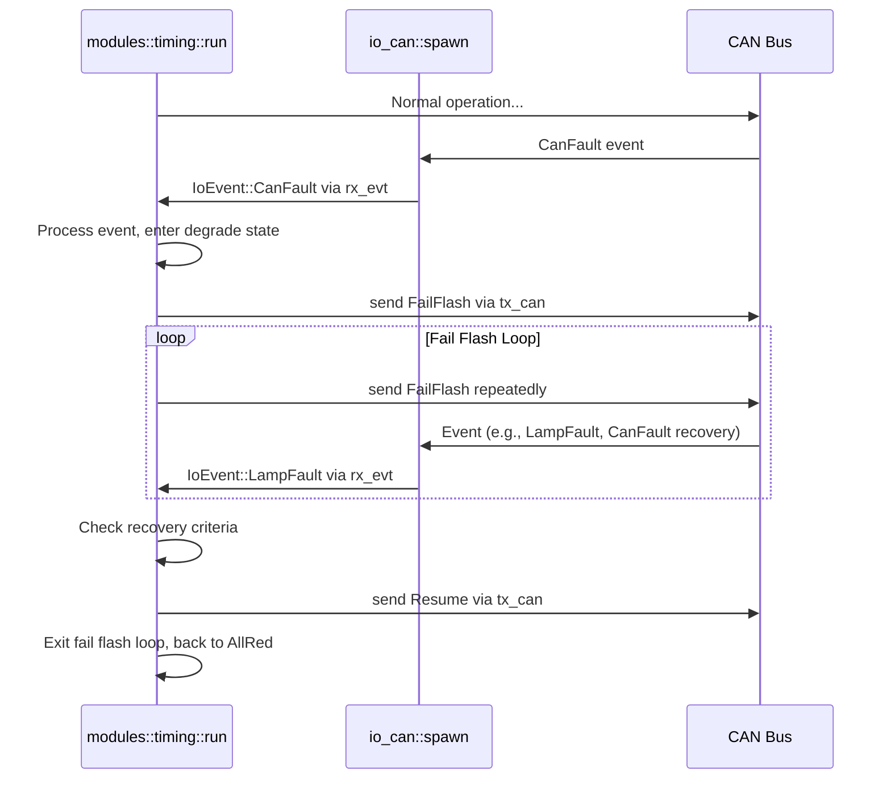

### 项目概览

  * **系统/产品名称：** `sigctl` (Traffic Signal Controller)
  * **主要业务目标与功能：** `sigctl` 是一个交通信号控制器的核心软件，它通过 CAN (Controller Area Network) 总线与驱动板通信，实现对交通信号灯的定时控制和状态监控。该系统可以根据预设的时序策略自动切换信号灯状态，同时处理来自 CAN 总线上的实时事件（如CAN总线故障、信号灯故障、电压异常等），并在检测到故障时自动进入降级（黄闪）模式以确保交通安全。
  * **典型用户与应用场景：** 该系统主要应用于需要对交通信号灯进行自动化控制的场景，例如城市交叉路口、隧道口、停车场出入口等。典型用户包括交通设备制造商、系统集成商、以及维护交通信号设备的技术人员。

-----

### 业务层面分析

#### 业务模块划分及职责

该系统业务主要围绕 CAN 总线通信和交通信号控制展开，可以划分为以下几个核心模块：

  * **核心控制器 (`core.rs`)：** 系统的“大脑”，负责启动所有子系统、协调各个模块，并委托控制权给具体的控制模块。它还维护一个周期性的心跳任务，以确保与驱动板的连接正常。
  * **定时控制模块 (`modules/timing.rs`)：** 实现了基于固定配时的交通信号控制逻辑。它是一个状态机，按预设时序在“全红”、“南北向绿”、“南北向黄”、“东西向绿”、“东西向黄”这几种状态间循环切换。该模块还负责处理故障事件，并根据预设规则进行降级处理。
  * **CAN I/O (`io_can.rs`)：** 负责与底层 CAN 总线进行实际的 I/O 通信。它根据操作系统类型分别实现了 Linux (使用 `socketcan` 库) 和非 Linux (模拟) 两种模式。该模块管理 CAN 帧的打包和解析，并使用异步通道（`mpsc::channel`）与核心控制器进行数据交换。
  * **CAN 功能库 (`can_func.rs`)：** 另一个 CAN 封装库，提供更通用的、与业务逻辑解耦的 CAN 通信接口，包括初始化、发送、接收回调等功能。虽然项目中使用 `io_can` 进行了具体实现，但 `can_func` 提供了另一种抽象和实现思路。
  * **面板串口 (`ui_panel.rs`)：** 一个可选的模块，用于与本地操作面板进行串口通信。它只实现了基本的读写骨架，未实现完整的协议解析。
  * **类型定义 (`types.rs`)：** 包含了整个系统的核心数据结构和枚举，如配置结构体 (`Config`)、CAN 命令枚举 (`Dn`、`Up`)、以及业务层消息 (`OutMsg`、`IoEvent`) 等。
  * **日志模块 (`log.rs`)：** 提供了一个简单的文件日志系统，支持日志轮转，用于记录系统运行状态和故障信息。

#### 核心业务对象及数据模型

  * **`Config`：** 系统启动时的全局配置，包含 CAN 接口、串口、CAN ID、信号灯配时、映射关系、策略等参数。
  * **`OutMsg`：** 上层业务逻辑发送给 CAN I/O 的消息，例如 `Heartbeat`、`SetLamp` (点控)、`Scheme` (方案下发)、`FailFlash` (黄闪) 等。
  * **`IoEvent`：** CAN I/O 接收并上报给上层业务逻辑的事件，例如 `BoardStatus` (驱动板状态)、`LampStatus` (信号灯状态)、`CanFault` (CAN 总线故障)、`LampFault` (信号灯故障) 等。
  * **`Timing`：** 核心的配时数据，定义了绿灯、黄灯、全红的时间长度。
  * **`Mapping`：** 定义了信号灯通道号与南北向/东西向红黄绿灯的映射关系。
  * **`TrafficState`：** 定时控制模块的状态枚举，包括 `AllRed`、`NsGreen`、`NsYellow`、`EwGreen`、`EwYellow`。
  * **`Dn` (`Downlink`) & `Up` (`Uplink`)：** CAN 协议中用于区分命令类型的枚举，分别对应主控下行和驱动板上行。

#### 主要业务流程与约束条件

**1. 正常运行流程（定时控制）**

  * 系统启动，读取配置文件，初始化 CAN I/O 和日志系统。
  * 核心控制器启动，并创建一个周期性的心跳任务。
  * 定时控制模块进入状态机循环。
  * **状态机流程：**
      * 全红 `(t.ar)` -\> 南北绿 `(t.g)` -\> 南北黄 `(t.y)` -\> 全红 `(t.ar)` -\> 东西绿 `(t.g)` -\> 东西黄 `(t.y)` -\> 循环。
  * 在每个状态转换时，定时控制模块通过 `tx_can` 通道发送相应的 `OutMsg::SetLamp` 或 `OutMsg::Scheme` 命令来控制信号灯状态。

**2. 故障处理与降级流程**

  * 在正常运行状态下，定时控制模块持续监听来自 `rx_evt` 的 `IoEvent`。
  * 如果接收到 `IoEvent::CanFault` (CAN 总线故障) 或 `IoEvent::LampFault` (信号灯故障) 事件，则触发降级。
  * **降级流程：**
      * 发送 `OutMsg::FailFlash` 命令，强制信号灯进入黄闪模式。
      * 进入一个 `fail_flash_loop`，持续发送黄闪命令，同时监听事件。
      * **恢复判据：** 只有当同时满足以下两个条件时，才会退出黄闪模式：
        1.  收到 CAN 恢复事件 (`CanFault { state: 0, ... }`)。
        2.  在 CAN 恢复后的一个稳定窗口期（`stable_window`，默认为2秒）内，没有新的灯故障事件。
      * 满足恢复判据后，发送 `OutMsg::Resume` 命令，然后重新回到“全红”状态，并恢复正常的定时控制流程。

**3. 配置与策略**

  * 系统支持通过 `config.yaml` 文件配置不同的定时策略 (`Strategy` 和 `NamedTiming`)。
  * `modules/timing.rs` 中的 `select_timing` 函数会检查 `active_profile` 配置，如果找到匹配的命名策略，则应用该策略，否则回退到默认的 `timing` 配置。

-----

### 技术架构分析

#### 整体架构风格

该系统采用\*\*单体（Monolithic）\*\*架构风格。所有功能模块（核心控制、CAN I/O、面板串口、日志等）都集成在一个 Rust 可执行程序中，通过进程内的异步通道（`mpsc::channel`）进行通信和数据同步。

#### 技术栈

  * **语言：** Rust
  * **异步运行时：** `tokio`，用于处理异步 I/O 和并发任务。
  * **CAN 通信库：** `socketcan` (仅限 Linux)，用于与 Linux Kernel 的 SocketCAN 子系统交互。
  * **串口通信库：** `serialport` (跨平台)，用于与操作面板通信。
  * **配置解析库：** `serde` 和 `serde_yaml`，用于从 YAML 文件反序列化配置数据。
  * **日志库：** 自研的简单文件日志模块 (`log.rs`)，支持日志轮转。
  * **其他辅助库：** `anyhow` (错误处理)、`once_cell` (懒加载单例)。

#### 模块层次结构和依赖关系

  * `main.rs`：启动入口，依赖 `types`、`io_can`、`ui_panel`、`core`、`log`。
  * `core.rs`：业务核心，依赖 `types`、`io_can`、`modules::timing`、`log`。
  * `io_can.rs`：I/O层，依赖 `types`、`log`、`socketcan` (Linux)。
  * `modules/timing.rs`：业务逻辑层，依赖 `types`、`log`。
  * `types.rs`：数据模型层，无业务依赖。
  * `log.rs`：工具层，无业务依赖。
  * `can_func.rs`：通用的 CAN 封装库，当前项目未直接使用，但其测试用例展示了另一种实现方式。

**依赖图**



#### 配置文件说明

`config.yaml` 配置文件包含以下主要参数：

  * **`can`：** `iface` (CAN 接口名称，如 `can0`) 和 `bitrate` (波特率)。
  * **`ids`：** `down` (下行 CAN ID) 和 `up` (上行 CAN ID)。
  * **`serial`：** `panel` (面板串口设备路径) 和 `baud` (波特率)。
  * **`timing`：** `g` (绿灯时长), `y` (黄灯时长), `ar` (全红时长)，单位毫秒。
  * **`mapping`：** 信号灯通道映射，如 `ns_r`、`ew_g` 等。
  * **`strategy` (可选)：**
      * `active_profile`：指定要使用的命名策略。
      * `profiles`：一个数组，包含多个 `NamedTiming`，每个都有 `name` 和 `timing`。
  * **`log`：** `file` (日志文件路径) 和 `max_bytes` (日志文件大小上限)。

-----

### 代码组织与工程结构

  * **项目文件和目录：**
      * `src/`: 源代码根目录
          * `main.rs`: 应用程序入口。
          * `types.rs`: 全局类型定义。
          * `io_can.rs`: CAN I/O 模块。
          * `core.rs`: 控制核心。
          * `ui_panel.rs`: 面板串口模块。
          * `log.rs`: 自研日志模块。
          * `can_func.rs`: 通用 CAN 封装库（当前未使用）。
          * `modules/`: 业务模块目录
              * `timing.rs`: 定时控制模块。
  * **代码风格：** 遵循 Rust 的惯例，使用了 `async/await` 语法和 `mpsc` 通道进行并发通信。函数和变量命名清晰，代码结构良好。
  * **自动化测试：** 项目包含 `io_can.rs`、`can_func.rs` 和 `modules/timing.rs` 的单元测试。测试用例涵盖了CAN帧的打包/解析以及定时策略选择等核心功能。
  * **打包与部署：** 源代码是 Rust 项目，通常使用 `cargo build --release` 进行编译，生成一个可执行文件。部署时只需将可执行文件和配置文件 (`config.yaml`) 放置在目标 Linux 系统上即可。

-----

### 接口与交互

  * **CAN I/O 接口 (`io_can::spawn`)：**
      * 输入：`Arc<Config>`
      * 输出：`(mpsc::Sender<OutMsg>, mpsc::Receiver<IoEvent>)`
      * 核心控制器通过 `tx_can` 发送控制命令，通过 `rx_evt` 接收事件。
  * **面板串口接口 (`ui_panel::spawn`)：**
      * 输入：`Arc<Config>`
      * 输出：`Result<PanelHandle>`
      * 提供一个 `PanelHandle`，其中包含一个 `mpsc::Sender` 用于向串口发送原始数据。
  * **数据流向：**
      * **控制命令：** `core` -\> `tx_can` (通道) -\> `io_can` (发送任务) -\> CAN总线 -\> 驱动板。
      * **状态事件：** 驱动板 -\> CAN总线 -\> `io_can` (接收任务) -\> `tx_evt` (通道) -\> `core` (或 `timing` 模块) -\> `rx_evt` (通道)。
      * **心跳：** 由 `core` 内部的独立任务周期性发送 `OutMsg::Heartbeat`。

**调用链示例 (正常运行)**



**调用链示例 (故障降级)**



-----

### 使用指南

#### 环境搭建、安装和运行步骤

1.  **安装 Rust：** 确保已安装 Rust 编程语言及其包管理工具 Cargo。
2.  **克隆代码仓库：** `git clone <repo_url>`
3.  **配置 CAN 接口 (Linux)：**
      * 使用 `ip` 命令配置并启动 CAN 接口，例如：
        ```sh
        sudo ip link set can0 type can bitrate 500000 restart-ms 200
        sudo ip link set up can0
        ```
      * （可选）使用 `vcan` 创建虚拟 CAN 接口进行测试：
        ```sh
        sudo modprobe vcan
        sudo ip link add dev vcan0 type vcan
        sudo ip link set up vcan0
        ```
4.  **配置 `config.yaml`：**
      * 在项目根目录下创建 `conf/` 目录，并创建一个名为 `config.yaml` 的文件，根据您的硬件和需求进行配置。
5.  **编译与运行：**
      * **编译：** `cargo build --release`
      * **运行：** `target/release/sigctl`
      * **模拟模式 (非 Linux)：** 直接运行即可，系统会自动使用模拟 CAN 接口。

#### 配置方法和常见参数说明

如“技术架构分析”部分所述，通过编辑 `conf/config.yaml` 文件来配置系统。

  * **`timing` 参数**：直接修改 `g`、`y`、`ar` 的值来改变交通信号灯的周期配时。
  * **`strategy` 参数**：如果要使用不同的定时方案，可以在 `profiles` 数组中添加新的 `NamedTiming` 条目，并通过修改 `active_profile` 来选择。
  * **`mapping` 参数**：如果信号灯通道号有变化，需要在这里进行修改以确保命令发送到正确的通道。

-----

### 维护与修改建议

#### 系统可扩展性、可维护性分析

  * **可扩展性：**
      * **CAN 协议：** 新增 CAN 命令或事件时，只需扩展 `types.rs` 中的 `Dn`、`Up`、`OutMsg`、`IoEvent` 枚举，并修改 `io_can.rs` 中的 `pack_dn` 和 `parse_up` 函数即可。
      * **控制策略：** `modules/timing` 模块的 `select_timing` 函数已经提供了简单的命名策略选择机制，可以轻松扩展以支持更复杂的日计划或时段控制。
      * **新接口：** 增加新的 I/O 接口（如网络接口）时，可以参考 `io_can.rs` 的模式，创建一个新的 `spawn` 函数并返回 `(Sender, Receiver)`，然后在 `core.rs` 中进行集成。
  * **可维护性：**
      * 代码结构清晰，职责分离良好。`io_can` 负责底层通信，`timing` 负责业务逻辑，`core` 负责协调。
      * 采用了 `tokio` 异步框架，使得 I/O 操作不会阻塞主循环，提高了系统的响应性。
      * 使用了 `mpsc` 通道，实现了模块间的解耦。

#### 关键技术风险、性能瓶颈、安全隐患

  * **技术风险：**
      * **`can_func.rs` 与 `io_can.rs` 的重叠：** 项目中存在两个不同的 CAN 通信封装。`io_can.rs` 直接集成在主逻辑中，而 `can_func.rs` 提供了独立的、更通用的 API。这可能导致混淆和重复开发。
      * **自研日志：** 自研的日志模块功能简单，可能无法满足复杂的生产需求（如多线程安全、日志级别控制、日志轮转策略、外部系统集成等）。
  * **性能瓶颈：**
      * **单线程 I/O 任务：** `io_can.rs` 中的发送和接收任务都是 `spawn_blocking` 调用的阻塞式任务。虽然这对于 I/O 密集型操作是合理的，但在高吞吐量场景下可能存在性能瓶颈。
  * **安全隐患：**
      * **CAN 通信：** CAN 协议本身不提供加密或身份验证。如果物理总线暴露在外，可能存在被恶意注入或篡改 CAN 帧的风险。
      * **配置管理：** 配置文件中的敏感信息（如果存在）未加密。

#### 优化、重构和改进方向

1.  **统一 CAN 模块：** 考虑将 `io_can.rs` 和 `can_func.rs` 的功能合并为一个统一的、可配置的 CAN 模块，提供更清晰的 API。
2.  **升级日志系统：** 替换自研的日志模块为成熟的、社区支持的 Rust 日志框架，如 `log` 配合 `env_logger`、`tracing` 或 `fern`。这将提供更强大的日志级别控制、格式化和目标输出（如控制台、文件、Syslog）。
3.  **完善面板通信：** 实现 `ui_panel.rs` 的完整协议解析逻辑，使其能够与操作面板进行双向数据交互，实现手动控制和状态查询功能。
4.  **引入更灵活的控制逻辑：**
      * 目前只有固定配时。可以扩展 `TimingController`，使其支持更复杂的业务模式，例如：
          * **感应控制：** 根据车流量传感器数据动态调整信号灯配时。
          * **协调控制：** 与其他路口的信号机进行通信，实现绿波带等功能。
          * **日计划/周计划：** 根据时间和日期自动选择不同的配时方案。
5.  **增强故障处理：**
      * **故障分级：** 对不同类型的故障进行分级处理，例如，对于临时的灯泡故障，可以只记录日志而不立即进入黄闪。
      * **远程诊断：** 添加通过网络发送故障日志或告警信息的功能。

-----

### 附加价值输出

#### 项目架构图

参见“技术架构分析”部分的 Mermaid 图。

#### 主要业务流程图

参见“业务层面分析”部分的 Mermaid 序列图。

#### 最佳实践建议和技术升级方案

  * **异步 I/O 最佳实践：** 尽管 `spawn_blocking` 是处理阻塞 I/O 的正确方式，但对于 CAN I/O 而言，如果底层库能够提供非阻塞的异步 API，则直接使用 `tokio::spawn` 并在 `async` 函数中调用会更高效和优雅。
  * **配置管理：** 考虑使用 `config-rs` 这样的库，它支持从文件、环境变量、命令行参数等多个来源加载配置，并提供默认值和验证功能，使配置管理更加健壮。
  * **状态机设计：** `modules/timing.rs` 中的状态机设计是一个良好的起点。为了处理更复杂的逻辑，可以考虑使用状态机库，如 `state_machine_future`，它能更清晰地定义状态、事件和转换，减少手动 `match` 语句的复杂性。
  * **错误处理：** 项目已使用了 `anyhow`，这是 Rust 社区处理错误的好实践。可以继续保持，并确保在可能出现错误的地方都使用 `?` 或 `context` 进行适当的错误包装。