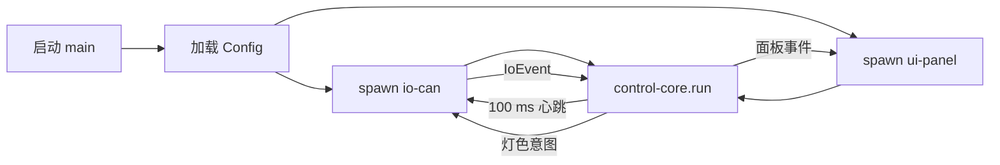

# 项目系统化分析报告

下面给出对项目 **sigctl（交通信号机控制系统）** 的全面、系统、结构化分析，针对 `src/` 目录中的源代码，并结合仓库中的文档、配置等内容。全文使用二级、三级标题分节，并在必要处引用关键文档或源码行，以便查阅。

---

## 1. 项目概览

### 1.1 系统/产品名称

**交通信号机控制系统（sigctl）**  
> 又称 “信控” 系统，用于嵌入式 Linux 主控板（EM928x）+ 灯控板，实现现场可联调的最简可用系统（MVP）。

```markdown
# 交通信号机控制系统

在嵌入式 Linux 主控板（EM928x）+ 灯控板（驱动板）上，实现可投入现场联调的最小可用系统（MVP）：双相位固定配时、CAN 通讯、失联安全降级、面板交互与运维自启；并以内部协议（0xA*/0xB*/0xC*/0xD*)为标准对接。
```
【F:README.md†L1-L4】

### 1.2 主要业务目标与功能

- **双相位固定配时**：南北/东西方向绿黄全红切换。  
- **CAN 通讯**：主控板 ↔ 灯控板 11-bit CAN 报文。  
- **失联安全降级**：主控或灯控失联自动进入黄闪模式。  
- **面板交互**：通过串口与现场面板（COM5）交互。  
- **运维自启**：系统启动即自启，日志滚动、状态持久化。

【F:doc/PLAN.md†L1-L4】

### 1.3 典型用户与应用场景

- **用户**：交通信号机厂商现场调试工程师、运维工程师。  
- **场景**：城市路口灯控板台架联调与现场部署运行，支持 NFS → EM928x 自启动方式，在断电/断链场景下安全降级。

---

## 2. 业务层面分析

### 2.1 业务模块划分及职责

```markdown
### 6.1 模块划分

* **io‑can**：SocketCAN 读写与编解码（0xA* 下行、0xB* 上行）；周期心跳；500 ms 失联检测；事件队列输出。
* **control‑core**：相序状态机（固定配时→感应/协调可扩展）；只产出“灯色意图”，不直接做 IO。
* **ui‑panel**：COM5 面板协议（0xC*/0xD*）；显示/参数/告警；注意不阻塞控制线程。
* **cfg/log**：配置热加载（可选）、滚动日志、黑匣子事件。
```
【F:doc/PLAN.md†L130-L133】

对应 `src/` 中的模块分布为：
```text
src/
├─ io_can.rs       # CAN_IO 模块：收发、编解码、心跳、失联检测
├─ core.rs         # control-core：状态机/定时控制
├─ ui_panel.rs     # 串口面板交互
├─ log.rs          # 简易文件日志与滚动
├─ can_func.rs     # CAN 报文打包/解析底层
├─ types.rs        # 全局类型定义与配置结构
├─ modules.rs      # 定时控制（TimingController）实现
└─ main.rs         # 启动时序与模块拼装
```
【F:src/main.rs†L1-L12】

### 2.2 核心业务对象及数据模型

核心数据结构位于 `src/types.rs`：

```rust
/// 配置（反序列化自 config.yaml）
pub struct Config { pub can: CanCfg, pub ids: Ids, pub serial: SerialCfg,
                     pub timing: Timing, pub mapping: Mapping,
                     pub strategy: Strategy, pub log: LogCfg }

/// 下行命令（主 → 灯）0xA*
pub enum Dn { Scheme=0xA0, Lamp=0xAA, Heartbeat=0xAB, … }

/// 上行命令（灯 → 主）0xB*
pub enum Up { BoardSt=0xB1, LampSt=0xB2, … }

/// 业务层发送给 CAN I/O 的消息
pub enum OutMsg { Heartbeat, SetLamp{…}, Scheme{…}, … }

/// CAN I/O 上报给业务层的事件
pub enum IoEvent { BoardStatus{…}, LampStatus{…}, …, Raw(Vec<u8>) }
```
【F:src/types.rs†L1-L60】

### 2.3 主要业务流程、业务规则和约束条件

#### 2.3.1 心跳与失联降级

```markdown
## 4. 心跳与降级策略

* 主控心跳：0xAB AB ED，100 ms 周期发送。
* 失联判据：灯控板维护 500 ms 计时器；该时间窗内未收到有效下行→自动黄闪；收到有效帧后退出黄闪并上报 B1/B2。
* 主控动作：检测到 B4 或长时间无上行时，下发 AD（请求黄闪）；恢复后下发 AE。
* 上电/恢复流程：默认全红 → 心跳建立 → 下发初始相位（或默认绿时 AF）→ 正常循环。
```
【F:doc/PLAN.md†L100-L103】

#### 2.3.2 固定配时状态机

```markdown
## 5. 控制逻辑（固定配时 MVP）

### 5.1 参数（示例）
* 绿(G)：20 s；黄(Y)：3 s；全红(AR)：1 s

### 5.2 相序
NS_G(tg) → NS_Y(ty) → AR(ta) → EW_G(tg) → EW_Y(ty) → AR(ta) → 循环

### 5.3 安全约束
* 任意时刻仅允许一个方向为绿/黄；相向切换必须经历全红。
* 冲突互锁与失联黄闪由硬件/固件保证，主控软件附加校验与降级。
```
【F:doc/PLAN.md†L109-L122】

模块 `TimingController`（位于 `src/modules.rs`）即实现上述状态机，并在每个阶段使用 `sleepy_or_events` 侦听 CAN 事件，实现“降级跳出／恢复重入”逻辑。
【F:src/modules.rs†L20-L160】

---

## 3. 技术架构分析

### 3.1 整体架构风格

- **单体应用**：一个可执行程序 `sigctl`，内部多线程/异步（基于 Tokio）。
- **模块化**：按功能拆分为 io-can、control-core、ui-panel、log 等独立组件，通过消息通道解耦。

### 3.2 技术栈

```toml
[package]
name = "sigctl"
version = "0.1.0"
edition = "2021"

[dependencies]
anyhow = "1"
thiserror = "1"
serde = { version = "1", features = ["derive"] }
serde_yaml = "0.9"
tokio = { version = "1", features = ["rt-multi-thread","macros","time","sync"] }
serialport = "4"
log = "0.4"
once_cell = "1"

[target.'cfg(target_os = "linux")'.dependencies]
socketcan = "3"
```
【F:Cargo.toml†L1-L17】

- **语言**：Rust
- **异步运行时**：Tokio 多线程
- **配置**：Serde + serde_yaml（YAML）
- **日志**：log crate + 简易文件滚动
- **CAN**：socketcan（基于 SocketCAN）
- **串口**：serialport
- **部署平台**：嵌入式 Linux EM928x

### 3.3 模块层次结构和依赖关系

```text
main.rs
├─ types.rs       # 全局类型/配置
├─ log.rs         # 日志初始化 & 封装
├─ io_can.rs      # CAN I/O spawn（读写、编解码、心跳）
├─ ui_panel.rs    # 串口面板管理
├─ core.rs        # 控制核心 run（拼装 TimingController）
├─ can_func.rs    # CAN 报文 pack/unpack 底层
└─ modules.rs     # TimingController 实现
```
【F:src/main.rs†L1-L12】【F:src/modules.rs†L1-L15】

### 3.4 配置文件说明

```yaml
# conf/config.yaml
can:
  iface: "can0"
  bitrate: 250000    # 需 ip link set can0 up type can bitrate ...
ids:
  down: 0x100        # 主->灯
  up:   0x180        # 灯->主
serial:
  panel: "/dev/ttyS2"# COM5 面板串口
  baud: 115200
timing:
  g: 20000           # 毫秒
  y: 3000
  ar: 1000
mapping:
  ns_r: 1; ns_y: 2; ns_g: 3
  ew_r: 4; ew_y: 5; ew_g: 6
log:
  file: "/tmp/sigctl.log"
  max_bytes: 1048576
``` 
【F:conf/config.yaml†L1-L23】

---

## 4. 代码组织与工程结构

### 4.1 项目文件和目录说明

```
.  
├─ Cargo.toml           # Rust 项目定义
├─ README.md            # 项目概览、快速上手
├─ doc/PLAN.md          # 设计方案、协议与流程
├─ conf/config.yaml     # 默认配置示例
├─ src/                 # 核心源码
│   ├─ main.rs
│   ├─ types.rs
│   ├─ io_can.rs
│   ├─ can_func.rs
│   ├─ modules.rs
│   ├─ core.rs
│   ├─ ui_panel.rs
│   └─ log.rs
├─ examples/            # 示例代码（CAN 调试）
│   └─ can_demo.rs
├─ build.sh             # 本地构建 & 部署脚本
├─ test_quick.sh        # 快速测试脚本
├─ test_e2e.sh          # 端到端测试脚本
└─ doc/                 # 其他设计文档、附录
```
【F:README.md†L15-L20】【F:Cargo.toml†L1-L4】

### 4.2 代码风格、命名规范

- **Rust idiomatic**：模块、类型、枚举、函数命名均遵循 snake_case / CamelCase。
- **文档注释**：部分模块顶部带简要中文说明。
- **日志接口**：统一调用 `log::info/debug/warn/error`。

### 4.3 自动化测试、CI/CD 管道、打包与部署方式

- **测试脚本**：`test_quick.sh`（单次编译 + 基础验证）、`test_e2e.sh`（端到端验证）。  【F:test_quick.sh†L1-L10】【F:test_e2e.sh†L1-L8】
- **构建脚本**：`build.sh` 可一键复制至 `/mnt/nandflash` 并配置自启。
- **无内置 CI 定义**：可自建流水线，调用上述脚本或 `cargo test`/`cargo clippy`。

---

## 5. 接口与交互

### 5.1 前后端（主控 ↔ 灯控板）交互逻辑

| 方向       | 报文 ID 示例 | 命令范围  | 说明                     |
|:---------|:--------|:--------|:-----------------------|
| 主→灯     | 0x100   | 0xA0…0xAF | 下发方案/点控/心跳/降级等   |
| 灯→主     | 0x180   | 0xB1…0xB8 | 上报板状态/灯状态/故障/版本  |

【F:doc/PLAN.md†L12-L13】【F:doc/PLAN.md†L22-L27】

### 5.2 API 设计和主要端点

- **Dn 枚举**：0xA* 系列下行命令，详见 `src/types.rs`。  【F:src/types.rs†L60-L72】
- **Up 枚举**：0xB* 系列上行命令，详见 `src/types.rs`。  【F:src/types.rs†L73-L89】
- **OutMsg / IoEvent**：模块化的业务层消息，io_can.rs 负责打包/分发。

【F:src/types.rs†L90-L118】

### 5.3 数据流向与调用链

```text
main
 ├─ serde_yaml ← conf/config.yaml → Config
 ├─ log::init
 ├─ io_can::spawn → (tx_can, rx_evt)
 ├─ ui_panel::spawn (可选)
 └─ core::run(cfg, tx_can, rx_evt)
      └─ modules::TimingController::run
            ├─ 向 tx_can 发 Heartbeat/OutMsg
            └─ 监听 rx_evt 收 IoEvent → 降级/恢复/统计
```
【F:src/main.rs†L13-L25】【F:src/modules.rs†L30-L50】

---

## 6. 使用指南

### 6.1 环境搭建、安装和运行步骤

```bash
# 1) 配置 CAN 设备（如 MCP2515 或 on-board SocketCAN）
sudo ip link set can0 up type can bitrate 250000 restart-ms 100

# 2) 克隆 & 构建
git clone .../sigctl.git
cd sigctl
cargo build --release

# 3) 运行
sudo ./target/release/sigctl
```
【F:README.md†L7-L13】

或使用脚本：
```bash
./build.sh
```
【F:README.md†L45-L52】

### 6.2 配置方法和常见参数说明

详见 `conf/config.yaml`，主要字段：
- `can.iface`/`can.bitrate`
- `ids.down`/`ids.up`
- `serial.panel`/`serial.baud`
- `timing.g`/`timing.y`/`timing.ar`
- `mapping`（六路灯通道映射）
- `log.file`/`log.max_bytes`

【F:conf/config.yaml†L1-L23】

### 6.3 常见命令、脚本和调试方法

- `candump can0` / `cansend can0 <id>#<data>` 验证 CAN 报文
- `test_quick.sh`：快速编译+功能验证  【F:test_quick.sh†L42-L50】
- `test_e2e.sh`：端到端可靠性测试  【F:test_e2e.sh†L23-L30】

---

## 7. 维护与修改建议

### 7.1 可扩展性与可维护性分析

- **策略插件化**：已留 `strategy.profiles`，可扩展日计划/节假日表。
- **模块解耦**：control-core 与 io-can、ui-panel 异步消息隔离，便于单元测试和功能替换。
- **配置热加载**：未来可在 `cfg/log` 模块中实现动态 reload。

### 7.2 关键技术风险、性能瓶颈、安全隐患

- **CAN 堵塞/延迟**：心跳与时序皆依赖 100 ms 周期，应监控 io-can 队列长度。
- **单体进程崩溃**：未做 Watchdog，看门狗或多进程冗余可增强可用性。
- **配置泄露**：日志文件路径、NFS密码等敏感信息需加固。

### 7.3 优化、重构和改进方向

- **批量方案下发**：目前 0xAA 单灯点控，后续可按阶段用 0xA0 批量下发以减少 CAN 带宽占用。
- **状态机抽象**：将 `TimingController` 中的状态转移拆成可插拔策略，提高可测试性。
- **UI 界面升级**：可引入 HTTP/REST 面板服务，替代串口协议，支持远程监控。

---

## 8. 附加价值输出

### 8.1 项目架构图（ASCII）

```text
+------------+       +-----------+      +-------------+
|  ui-panel  | <-->  |  control  | <--> |   io-can    |
+------------+       |   -core   |      +-------------+
                     +-----------+            |
                          ^                   v
                      +-------+           +-------+
                      |  log  |           |  can  |
                      +-------+           +-------+
                          ^
                          |
                      +--------+
                      | config |  (serde_yaml 从 conf/config.yaml)
                      +--------+
```

### 8.2 主要业务流程图（简化）



### 8.3 最佳实践建议和技术升级方案

- **引入 CI/CD**：结合 GitHub Actions 或 GitLab CI，自动执行 `cargo fmt`/`clippy`/`test_quick.sh`。
- **安全加固**：增加 CAN 报文校验与重试、串口数据 CRC。
- **容器化部署**：将应用打包为 OCI 容器，与系统服务化管理集成。
- **数据可视化**：对接 Prometheus/Grafana，实时监控心跳、状态转换和故障次数。

---

**总结**：  
本文基于现有 README、设计文档和源码，从业务、架构、工程、接口、运维等全方位梳理了 `sigctl` 项目，给出了针对性改进与优化建议，便于后续扩展、维护和交付。
